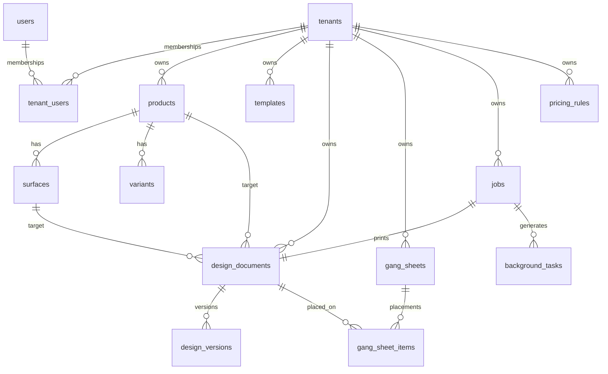

# Database Schema Overview

This document captures the first pass of the relational model that will back the gang sheet builder platform.  
The design targets a **multi-tenant** SaaS architecture where a single database hosts:

* **Super Admin** views – global catalog, supplier definitions, pricing defaults, audit.
* **Merchant Tenants** – isolated products/surfaces, templates, design assets, orders.
* **Merchant Staff / Operators** – job tickets, production outputs, gang sheets.

The schema balances normalization with JSON fields for high-variance payloads (design snapshots, rule parameters).

---

## Core Tenancy & Identity

| Table | Purpose | Key Columns | Notes |
|-------|---------|-------------|-------|
| `tenants` | Merchant accounts (one per store) | `id (UUID)`, `slug`, `plan_id`, `status`, `branding` (JSONB) | Super admin owns this data. Branding payload can store logo/colors/typography. |
| `plans` | Subscription plans / limits | `id`, `name`, `limits` (JSONB), `price_monthly` | Enables feature flagging per tenant. |
| `users` | Platform users | `id`, `email`, `hashed_password`, `display_name`, `status` | Password auth for internal portal; Shopify SSO handled separately. |
| `tenant_users` | User ↔ tenant membership | `tenant_id`, `user_id`, `role` (`super_admin`, `merchant_admin`, `merchant_staff`) | Supports multi-tenant staff and global admins. |
| `api_tokens` | HMAC/API access | `tenant_id`, `key`, `secret_hash`, `scopes`, `expires_at` | Used for Shopify proxy & webhooks. |

### Access Control

* `tenant_users.role` drives RBAC in both API and front-end CASL setup.
* Row-level security (if enabled) can reference `tenant_id` on tables below.

---

## Catalog & Surfaces

| Table | Purpose | Key Columns | Notes |
|-------|---------|-------------|-------|
| `products` | Product definitions per tenant | `id`, `tenant_id?`, `slug`, `title`, `category`, `shopify_product_id`, `default_surface_id`, `attributes` (JSONB) | Global catalog entries set `tenant_id` NULL; merchants can override/duplicate. |
| `surfaces` | Print surfaces for a product | `id`, `product_id`, `name`, `width_mm`, `height_mm`, `safe_area` (JSONB with x/y/w/h), `mask_svg`, `ppi` | Keep safe & bleed definitions. |
| `variants` | Product variants | `id`, `product_id`, `shopify_variant_id`, `sku`, `options` (JSONB) | Optional for downstream line-item mapping. |
| `print_techniques` | Supported print methods | `id`, `tenant_id?`, `name`, `rules` (JSONB) | Global defaults owned by super admin; merchants override by `tenant_id`. |
| `supplier_profiles` | Outsourced production partners | `id`, `tenant_id?`, `name`, `regions` (JSONB), `techniques` (array), `lead_time_days` | Global or tenant-specific. |

---

## Templates & Assets

| Table | Purpose | Key Columns | Notes |
|-------|---------|-------------|-------|
| `templates` | Re-usable editor templates | `id`, `tenant_id?`, `name`, `target_product_id`, `target_surface_id`, `default_print_tech_id`, `payload` (JSONB), `is_public` | `payload` stores Konva JSON. |
| `template_tags` | Tagging for templates | `template_id`, `tag` | Quick filter / marketing categories. |
| `asset_library_items` | Merchant-managed assets | `id`, `tenant_id`, `type` (`image`, `font`, `icon`), `url`, `metadata` (JSONB), `source` | Supports Google Fonts / custom fonts / icons. |

---

## Editor Session & Designs

| Table | Purpose | Key Columns | Notes |
|-------|---------|-------------|-------|
| `design_documents` | Saved customer designs | `id`, `tenant_id`, `user_id?`, `product_id`, `surface_id`, `print_technique_id`, `status`, `snapshot` (JSONB), `preview_url`, `sheet_width_mm`, `sheet_height_mm` | `status` covers draft, submitted, approved. |
| `design_versions` | Version history | `id`, `design_id`, `version`, `payload` (JSONB), `created_at` | Append-only; helpful for auditing & rollback. |
| `gang_sheets` | Gang sheet sessions | `id`, `tenant_id`, `name`, `sheet_width_mm`, `sheet_height_mm`, `utilization`, `snapshot` (JSONB), `preview_url` | JSON stores layout & placements. |
| `gang_sheet_items` | Designs placed on gang sheet | `id`, `gang_sheet_id`, `design_id`, `quantity`, `position` (JSONB) | Allows reflow analytics and cost calc. |
| `jobs` | Production jobs / tickets | `id`, `tenant_id`, `order_id`, `design_id`, `print_technique_id`, `supplier_id`, `status`, `outputs` (JSONB), `attachments` (JSONB) | `outputs` links to S3 file manifests. |
| `orders` | Snapshot of Shopify order context | `id`, `tenant_id`, `shopify_order_id`, `customer_email`, `currency`, `subtotal`, `metadata` (JSONB) | Optional but useful for analytics. |

---

## Pricing & Rules

| Table | Purpose | Key Columns | Notes |
|-------|---------|-------------|-------|
| `pricing_rules` | Dynamic pricing formulas | `id`, `tenant_id`, `scope` (`product`, `technique`, `area`), `criteria` (JSONB), `formula` (JSONB), `active` | JSON stores thresholds, price tiers. |
| `discounts` | Promotions / coupons | `id`, `tenant_id`, `code`, `config` (JSONB), `expires_at`, `usage_limit` | Merchant-managed marketing promos. |
| `tax_profiles` | Tax handling by region | `id`, `tenant_id`, `region_code`, `rate`, `config` (JSONB) | Optional if Shopify handles taxation. |

---

## Audit & Observability

| Table | Purpose | Key Columns | Notes |
|-------|---------|-------------|-------|
| `audit_logs` | Who changed what | `id`, `tenant_id?`, `actor_user_id?`, `event`, `entity`, `entity_id`, `diff` (JSONB), `ip_address`, `user_agent` | Super admin needs global view. |
| `webhook_events` | Shopify webhooks ingestion | `id`, `tenant_id`, `topic`, `payload` (JSONB), `status`, `received_at`, `processed_at`, `error` | Replay / failure debugging. |
| `background_tasks` | Long running operations | `id`, `tenant_id?`, `type`, `payload` (JSONB), `state`, `started_at`, `finished_at`, `error` | Ties into worker queue. |

---

## Relationships Snapshot

---

## Implementation Notes

* **UUID primary keys** across tables ease data sharing between regions and avoid integer sequence contention.
* Use `TIMESTAMPTZ` columns for all temporal data; Prisma maps to `Date` in TypeScript.
* JSON-heavy columns (`snapshot`, `rules`, `outputs`) remain indexable via Postgres GIN indices where necessary.
* For multi-tenancy safety, add partial indexes `(tenant_id, ...)` and enforce foreign keys referencing `tenant_id` consistently.
* Sensitive data (API secrets, supplier credentials) should be encrypted at rest (pgcrypto) or stored in a secrets manager.

This schema is intentionally comprehensive; we can trim/expand tables when we implement the Prisma models. The next step is translating this outline into `schema.prisma` with enums, relations, and initial seed data.
